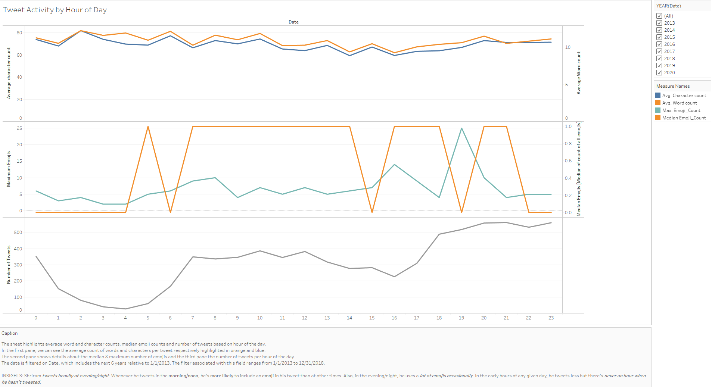
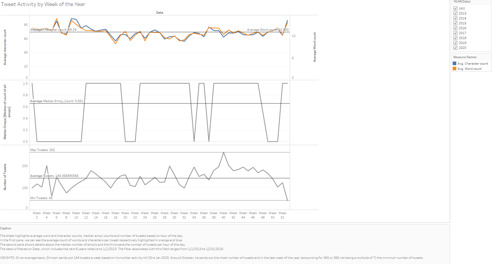
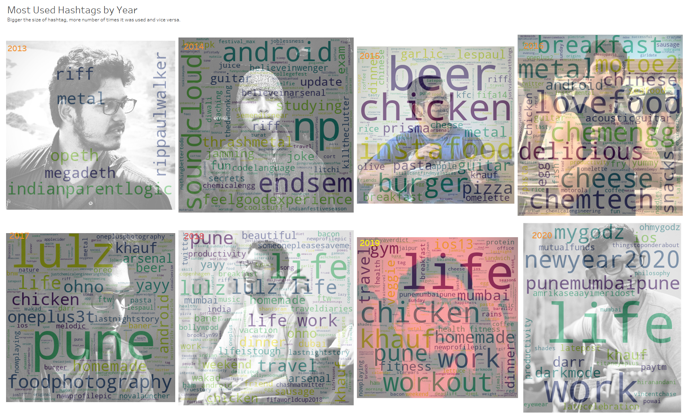
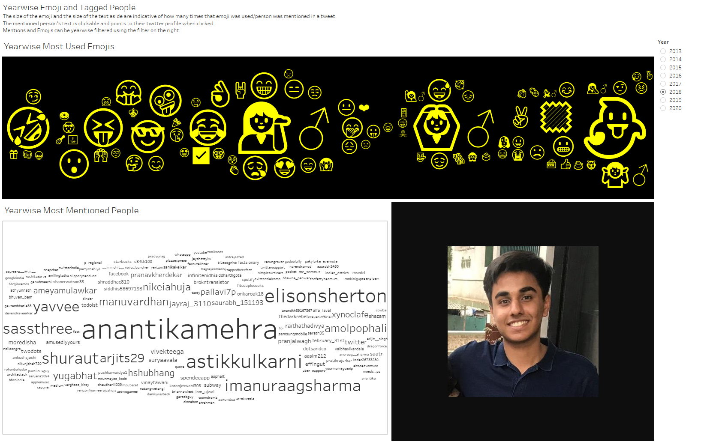
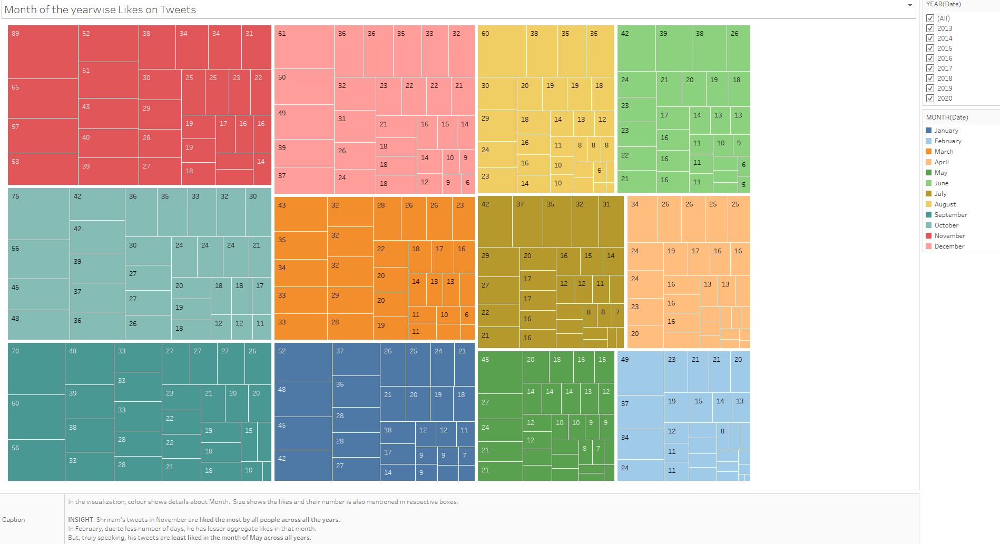

# Twitter User Analysis and Visualization
 Scrape tweets from a persons profile and visualize it to find interesting insights
 
This project aims to understand the behavior of a user through their tweets and interaction with other users on a popular social media platform called twitter. I reached out to a friend of mine [Shriram Dusane](https://twitter.com/shriramdusane) and he nodded his consent for the data to be used for the sake of this analysis.

I scraped the tweets using this tool from github called twint which gave me all the data I needed for the sake of this analysis. You can look up the link attached above in order to explore the tool but for those who're short on patience, you can open up your anaconda prompt and type in the following commands to extract a user's info using [twint](https://github.com/twintproject/twint).

```
pip3 install twint
twint -u username -o file.json --json
```

In place of the username, type in the user's name i.e. @shriramdusane or @xyz and in place of file, type in the name of the file you want to save the tweets as. The file will be stored in the destination from where you're running the anaconda prompt.

After cleaning and organizing data into a neat and clean file [All steps with code and explanations here](https://github.com/ElisonSherton/Twitter-User-Analysis-and-Visualization/blob/master/Twitter%20User%20Analysis%20And%20Visualization.ipynb), we can proceed to do our visualization and these are insights that we get.

The complete visualization in all it's glory with interactivity is available [here](https://public.tableau.com/profile/elisonsherton#!/vizhome/TwitterUserAnalysis/YearwiseEmojiandTaggedPeople).

## Analyzing tweet activity by hour of the day:

It is apparent from the chart below that Shriram's twitter activity is mostly in the evening/night time. Although his activity is scarce in the early morning hours, nonetheless it's not zero. It means he has tweeted at least once on all the hours of the day in the past 8 years. You're surely a serious tweeter Ram!



## Analyzing tweet activity by week of the year.
On an average, Shriram has sent about 144 tweets in a week. Also each tweet averages around 70 characters per tweet. 



## Most used Hashtags
The image below shows the most used hashtags split according to the years where he has tweeted. Since he joined in late 2013 and as it's hardly a month in 2020, those two wordclouds look very scarce but otherwise, we can make a reasonable approximation in other years. #Lulz, #Life, #Work, #Chicken, #Pune, #Mumbai seem to be the most repeated hashtags over the course of these years.



## Yearwise Mentions And Emojis
Shriram mentions a lot of people in a lot of his tweets and his tweets are replete with emojis. This dashboard describes the most mentioned people and most used emojis as a function of every year.

In 2013, there were no emojis in his tweets, so that year is a blank. Otherwise, it can be seen that @anantikamehra, @astikkulkarni, @nikeiahuja, @manuvardhan, @sassthree, @yavee, @shuraut, @yugabhat are repeating mentions meaning he's well in touch with them on social media. Although, his connect with @nikeiahuja has been decreasing over these years. This is an interactive dashboard and I request you to head to this [Tableau Visualization](https://public.tableau.com/profile/elisonsherton#!/vizhome/TwitterUserAnalysis/YearwiseEmojiandTaggedPeople) to experience the dashboard and utilize it's functions and controls.



## Yearwise Likes
People seem to like Shriram's tweets most in the month of November and least in the month of May (excluding February since it has less days). 



That's it for this visualization. Hope you liked it and had as much fun going through it as I had while making it :)

**PS: Following is a list of websites/resources I used while making this visualization**

- https://www.avatars.io/
- [Udemy Course on Tableau](https://www.udemy.com/course/tableau-2018-tableau-10-qualified-associate-certification/?LSNPUBID=vedj0cWlu2Y&ranEAID=vedj0cWlu2Y&ranMID=39197&ranSiteID=vedj0cWlu2Y-9zCYyeESTGgGxQosiwrMBA)
- https://stackoverflow.com/
